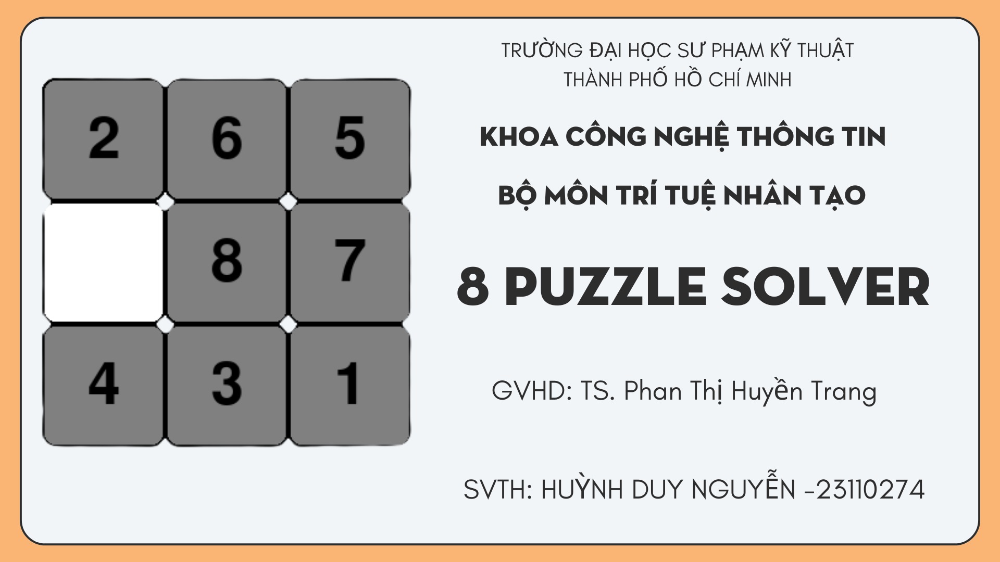
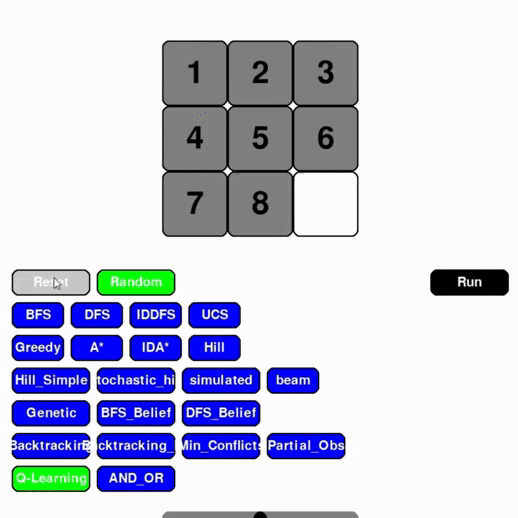
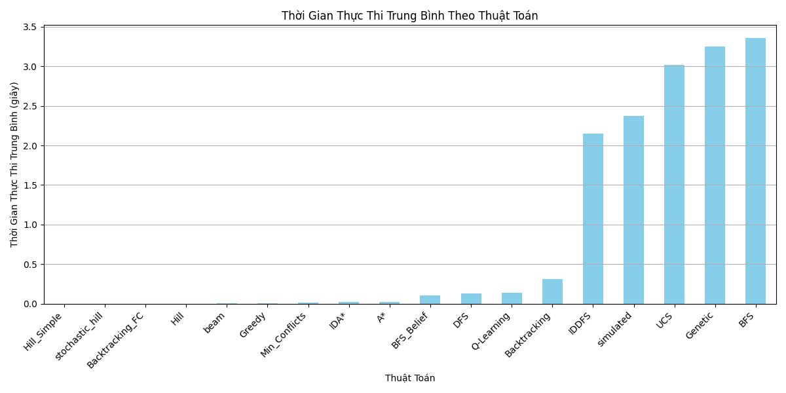

# 8 Puzzle Solver - Trí Tuệ Nhân Tạo
 

## Sinh Viên Thực hiện

-   **Họ và tên**: Huỳnh Duy Nguyễn
-   **MSSV**: 23110274

## 1. Mục tiêu

Dự án này được xây dựng nhằm mục đích triển khai và minh họa hoạt động của các thuật toán Trí Tuệ Nhân Tạo (AI) khác nhau trong việc giải quyết bài toán 8-Puzzle cổ điển. Mục tiêu chính bao gồm:
-   Hiểu rõ cách các thuật toán tìm kiếm và giải quyết vấn đề hoạt động.
-   So sánh hiệu suất (thời gian, số bước, bộ nhớ sử dụng) giữa các thuật toán.
-   Cung cấp một công cụ trực quan để người dùng tương tác và quan sát quá trình giải bài toán.

---

## 2. Nội dung

### 2.1 Tổng quan về Bài toán 8-Puzzle và Giải thuật Tìm kiếm

#### 2.1.1 Các thành phần chính của bài toán 8-Puzzle

Bài toán 8-Puzzle có thể được mô tả chính thức với các thành phần sau:
-   **Trạng thái (State):** Một cấu hình cụ thể của 8 ô số (từ 1 đến 8) và một ô trống (thường ký hiệu là 0) trên một lưới 3x3.
-   **Trạng thái ban đầu (Initial State):** Cấu hình xuất phát của bài toán mà người dùng cung cấp hoặc được tạo ngẫu nhiên.
-   **Trạng thái đích (Goal State):** Cấu hình mong muốn cần đạt tới. Thông thường là `[[1, 2, 3], [4, 5, 6], [7, 8, 0]]`.
-   **Hành động (Actions):** Các phép toán có thể thực hiện để chuyển từ trạng thái này sang trạng thái khác. Trong 8-Puzzle, hành động là di chuyển ô trống theo một trong bốn hướng: Lên (Up), Xuống (Down), Trái (Left), Phải (Right), nếu nước đi đó hợp lệ (không ra ngoài biên).
-   **Hàm chuyển đổi (Transition Model):** Mô tả kết quả của việc thực hiện một hành động từ một trạng thái. Ví dụ, nếu ô trống ở giữa và hành động là "Lên", ô trống sẽ đổi chỗ với ô số phía trên nó.
-   **Chi phí đường đi (Path Cost):** Chi phí để đi từ trạng thái ban đầu đến một trạng thái n. Trong bài toán 8-Puzzle cơ bản, mỗi bước di chuyển ô trống thường có chi phí là 1.

#### 2.1.2 Solution (Lời giải) là gì?

Một **lời giải** cho bài toán 8-Puzzle là một **chuỗi các hành động** (các bước di chuyển ô trống) dẫn từ **trạng thái ban đầu** đến **trạng thái đích**. Mục tiêu của các thuật toán tìm kiếm là tìm ra một lời giải như vậy, và tùy thuộc vào thuật toán, lời giải đó có thể là tối ưu (ngắn nhất) hoặc không.

---

### 2.2 Các Nhóm Thuật Toán Được Triển Khai

Dưới đây là chi tiết về các nhóm thuật toán được sử dụng trong dự án này để giải bài toán 8-Puzzle.

#### 2.2.1 Uninformed Search (Tìm kiếm không thông tin - Tìm kiếm mù)

*Mô tả chung:* Các thuật toán này không sử dụng bất kỳ thông tin bổ sung nào về bài toán ngoài định nghĩa của nó (ví dụ: không biết trạng thái hiện tại "gần" hay "xa" đích như thế nào). Chúng duyệt không gian trạng thái một cách có hệ thống.

*   **BFS (Breadth-First Search - Tìm kiếm theo chiều rộng)**
    *   **Mô tả:** Duyệt tất cả các nút ở độ sâu hiện tại trước khi chuyển sang các nút ở độ sâu tiếp theo. Sử dụng hàng đợi (Queue - FIFO).
    *   **Lời giải:** Đảm bảo tìm thấy lời giải nông nhất (tối ưu về số bước nếu chi phí mỗi bước là như nhau).
    *   **Hình ảnh GIF minh họa BFS:**
    
    

    *   **Nhận xét:**
        *   **Tính đầy đủ (Complete):** Có, nếu không gian trạng thái hữu hạn.
        *   **Tính tối ưu (Optimal):** Có, nếu chi phí mỗi bước là đồng nhất.
        *   **Độ phức tạp thời gian:** O(b^d), với b là yếu tố rẽ nhánh, d là độ sâu của lời giải.
        *   **Độ phức tạp không gian:** O(b^d), cần lưu trữ nhiều nút trong hàng đợi.

*   **DFS (Depth-First Search - Tìm kiếm theo chiều sâu)**
    *   **Mô tả:** Duyệt sâu nhất có thể dọc theo mỗi nhánh trước khi quay lui. Sử dụng ngăn xếp (Stack - LIFO) hoặc đệ quy.
    *   **Lời giải:** Tìm thấy một lời giải nhưng không đảm bảo là tối ưu.
    *   **Hình ảnh GIF minh họa DFS:**
           
    

    *   **Nhận xét:**
        *   **Tính đầy đủ:** Không, nếu không gian trạng thái có nhánh vô hạn và không có kiểm tra vòng lặp/giới hạn độ sâu. Có nếu không gian hữu hạn.
        *   **Tính tối ưu:** Không.
        *   **Độ phức tạp thời gian:** O(b^m), với m là độ sâu tối đa của không gian trạng thái (có thể tệ hơn b^d).
        *   **Độ phức tạp không gian:** O(b*m) (nếu dùng đệ quy với ngăn xếp hệ thống) hoặc O(m) (nếu chỉ lưu đường đi hiện tại), tốt hơn BFS.

*   **UCS (Uniform Cost Search - Tìm kiếm chi phí đồng nhất)**
    *   **Mô tả:** Mở rộng nút chưa được duyệt có chi phí đường đi g(n) thấp nhất từ nút gốc. Sử dụng hàng đợi ưu tiên.
    *   **Lời giải:** Đảm bảo tìm thấy lời giải có tổng chi phí thấp nhất.
    *   **Hình ảnh GIF minh họa UCS:**

       
       
    *   **Nhận xét:**
        *   **Tính đầy đủ:** Có, nếu chi phí mỗi bước > 0.
        *   **Tính tối ưu:** Có.
        *   **Độ phức tạp thời gian/không gian:** Tương tự BFS nếu chi phí đồng nhất, có thể tệ hơn nếu chi phí biến thiên nhiều. O(b^(C*/ε)), với C* là chi phí lời giải tối ưu, ε là chi phí bước nhỏ nhất.

*   **IDDFS (Iterative Deepening Depth-First Search - Tìm kiếm sâu dần lặp)**
    *   **Mô tả:** Kết hợp ưu điểm của DFS (ít tốn bộ nhớ) và BFS (tối ưu, đầy đủ). Thực hiện DFS với giới hạn độ sâu tăng dần (0, 1, 2,...).
    *   **Lời giải:** Tương tự BFS, tìm lời giải nông nhất.
    *   **Hình ảnh GIF minh họa IDDFS:**

        

    *   **Nhận xét:**
        *   **Tính đầy đủ:** Có.
        *   **Tính tối ưu:** Có (nếu chi phí đồng nhất).
        *   **Độ phức tạp thời gian:** O(b^d). Mặc dù duyệt lại các nút, chi phí không quá lớn so với BFS.
        *   **Độ phức tạp không gian:** O(b*d), tốt như DFS.

*   **Hình ảnh so sánh hiệu suất các thuật toán Uninformed Search:**
    
       |  

*   **Nhận xét chung về Uninformed Search:**
    Các thuật toán này là nền tảng cơ bản nhưng có thể không hiệu quả cho các không gian tìm kiếm lớn do không có "hướng dẫn" nào về phía mục tiêu.

---

#### 2.2.2 Informed Search (Tìm kiếm có thông tin – Heuristic Search)

*Mô tả chung:* Sử dụng một hàm đánh giá heuristic h(n) để ước lượng chi phí từ trạng thái hiện tại n đến trạng thái đích. Thông tin này giúp hướng dẫn tìm kiếm về phía các trạng thái hứa hẹn hơn.
*Hàm Heuristic phổ biến cho 8-Puzzle:*
    1.  **Số ô sai vị trí (Number of misplaced tiles):** Đếm số ô (không tính ô trống) không nằm ở vị trí đúng so với trạng thái đích.
    2.  **Khoảng cách Manhattan (Manhattan distance):** Tổng khoảng cách (theo chiều ngang và dọc) của mỗi ô số từ vị trí hiện tại của nó đến vị trí đúng trong trạng thái đích.

*   **Greedy Search (Tìm kiếm tham lam)**
    *   **Mô tả:** Luôn chọn mở rộng nút có vẻ gần đích nhất theo hàm heuristic h(n). Không quan tâm đến chi phí đã đi g(n).
    *   **Lời giải:** Thường tìm ra lời giải nhanh nhưng không đảm bảo tối ưu.
    *   **Hình ảnh GIF minh họa Greedy Search:**
        
           

    *   **Nhận xét:**
        *   **Tính đầy đủ:** Không (có thể bị kẹt trong vòng lặp nếu không kiểm tra). Có trong không gian hữu hạn với kiểm tra nút đã thăm.
        *   **Tính tối ưu:** Không.
        *   **Độ phức tạp thời gian/không gian:** Phụ thuộc vào chất lượng heuristic, có thể là O(b^m) trong trường hợp xấu nhất.

*   **A\* (A-Star)**
    *   **Mô tả:** Mở rộng nút có tổng chi phí f(n) = g(n) + h(n) nhỏ nhất, trong đó g(n) là chi phí thực tế từ gốc đến n, và h(n) là chi phí heuristic ước lượng từ n đến đích.
    *   **Lời giải:** Đảm bảo tìm thấy lời giải tối ưu nếu hàm heuristic h(n) là *admissible* (không bao giờ đánh giá quá cao chi phí thực tế đến đích) và *consistent* (hoặc monotone).
    *   **Hình ảnh GIF minh họa A\*:**

         

    *   **Nhận xét:**
        *   **Tính đầy đủ:** Có.
        *   **Tính tối ưu:** Có (với điều kiện heuristic).
        *   **Độ phức tạp thời gian/không gian:** Phụ thuộc vào chất lượng heuristic. Có thể là hàm mũ trong trường hợp xấu nhất, nhưng thường tốt hơn nhiều so với Uninformed Search. Vẫn có thể tốn nhiều bộ nhớ.

*   **IDA\* (Iterative Deepening A\* - A\* lặp sâu dần)**
    *   **Mô tả:** Phiên bản của A\* sử dụng ít bộ nhớ hơn. Thực hiện một loạt các tìm kiếm theo chiều sâu. Mỗi lần lặp, ngưỡng cắt là giá trị f-cost nhỏ nhất đã vượt quá ngưỡng ở lần lặp trước.
    *   **Lời giải:** Tương tự A\*, tìm lời giải tối ưu với điều kiện heuristic.
    *   **Hình ảnh GIF minh họa IDA\*:**

         

    *   **Nhận xét:**
        *   **Tính đầy đủ:** Có.
        *   **Tính tối ưu:** Có (với điều kiện heuristic).
        *   **Độ phức tạp thời gian:** Tương tự A\* nếu heuristic tốt, có thể duyệt lại nút.
        *   **Độ phức tạp không gian:** O(b*d), tốt như DFS.
    **Hình ảnh so sánh hiệu suất các thuật toán Informed Search:**
    
       |  

*   **Nhận xét chung về Informed Search:**
    Sử dụng heuristic giúp cải thiện đáng kể hiệu quả tìm kiếm so với các phương pháp mù. Chất lượng của hàm heuristic rất quan trọng.

---

#### 2.2.3 Local Search (Tìm kiếm cục bộ)

*Mô tả chung:* Các thuật toán này không xây dựng đường đi từ đầu đến cuối mà bắt đầu từ một trạng thái (thường là ngẫu nhiên hoặc trạng thái ban đầu) và cố gắng cải thiện nó dần dần bằng cách thực hiện các thay đổi cục bộ. Chúng thường chỉ quan tâm đến trạng thái hiện tại và các trạng thái lân cận, không lưu trữ lịch sử đường đi.
*Solution là gì:* Mục tiêu là tìm được một trạng thái là trạng thái đích. Đường đi đến đó có thể được ghi lại nếu cần, nhưng không phải là trọng tâm của thuật toán.
 *    **Hill Simple (Leo đồi đơn giản)**
    *   **Hình ảnh GIF minh họa Hill Climbing:**

       

*   **Hill Climbing (Leo đồi dốc nhất)**
    *   **Mô tả (Steepest-Ascent):** Tại mỗi bước, di chuyển đến trạng thái lân cận "tốt nhất" (ví dụ: có giá trị heuristic thấp nhất đối với 8-Puzzle, nghĩa là gần đích hơn). Nếu không có lân cận nào tốt hơn, thuật toán dừng lại.
    *   **Hình ảnh GIF minh họa Hill Climbing:**

          

    *   **Nhận xét:**
        *   Đơn giản, nhanh và tốn ít bộ nhớ.
        *   Dễ bị kẹt ở **cực tiểu địa phương** (local optimum), **đỉnh phẳng** (plateau), hoặc **sườn núi** (ridge). Không đảm bảo tìm được nghiệm toàn cục (trạng thái đích).

*   **Stochastic Hill Climbing (Leo đồi ngẫu nhiên)**
    *   **Mô tả:** Thay vì chọn lân cận tốt nhất, thuật toán này chọn ngẫu nhiên một trong số các lân cận tốt hơn trạng thái hiện tại.
    *   **Hình ảnh GIF minh họa Stochastic Hill Climbing:**

     

    *   **Nhận xét:** Có thể khám phá không gian tìm kiếm rộng hơn so với Steepest-Ascent Hill Climbing, nhưng vẫn có thể bị kẹt.

*   **Simulated Annealing (Luyện kim mô phỏng)**
    *   **Mô tả:** Lấy cảm hứng từ quá trình luyện kim. Cho phép di chuyển đến các trạng thái "xấu hơn" (heuristic cao hơn) với một xác suất nhất định. Xác suất này giảm dần theo một tham số "nhiệt độ" (T). Ban đầu nhiệt độ cao, cho phép nhiều bước nhảy ngẫu nhiên để thoát khỏi cực tiểu địa phương. Khi nhiệt độ giảm, thuật toán trở nên "tham lam" hơn.
    *   **Hình ảnh GIF minh họa Simulated Annealing:**

    

    *   **Nhận xét:** Có khả năng thoát khỏi cực tiểu địa phương tốt hơn Hill Climbing. Hiệu quả phụ thuộc vào lịch trình giảm nhiệt độ và các tham số khác.

*   **Beam Search (Tìm kiếm chùm)**
    *   **Mô tả:** Một biến thể của tìm kiếm theo chiều rộng. Tại mỗi bước, chỉ giữ lại k trạng thái "tốt nhất" (beam width) để mở rộng tiếp. Các trạng thái khác bị loại bỏ.
    *   **Hình ảnh GIF minh họa Beam Search:**
    
    

    *   **Nhận xét:** Tiết kiệm bộ nhớ so với BFS. Nếu k quá nhỏ, có thể bỏ lỡ lời giải. Không đảm bảo tính đầy đủ hay tối ưu.

*   **GA (Genetic Algorithm - Thuật toán di truyền)**
    *   **Mô tả:** Dựa trên các nguyên lý của tiến hóa và chọn lọc tự nhiên. Duy trì một "quần thể" (population) các trạng thái (cá thể - individuals). Mỗi cá thể được đánh giá bằng một "hàm thích nghi" (fitness function - thường dựa trên heuristic). Các cá thể tốt hơn có nhiều khả năng được chọn để "sinh sản" (tạo thế hệ mới) thông qua các toán tử "lai ghép" (crossover) và "đột biến" (mutation).
    *   **Hình ảnh GIF minh họa Genetic Algorithm:**

    

    *   **Nhận xét:** Mạnh mẽ cho các bài toán tối ưu hóa phức tạp. Cần nhiều tham số để tinh chỉnh (kích thước quần thể, tỷ lệ lai ghép/đột biến,...). Có thể hội tụ chậm.

*   **Nhận xét chung về Local Search:**
    Hữu ích khi chỉ cần tìm một trạng thái nghiệm mà không nhất thiết cần đường đi tối ưu. Thường sử dụng ít bộ nhớ.

---

#### 2.2.4 CSPs (Constraint Satisfaction Problems - Bài toán thỏa mãn ràng buộc)

*Mô tả chung:* Một CSP được định nghĩa bởi một tập hợp các biến, mỗi biến có một miền giá trị, và một tập hợp các ràng buộc quy định các tổ hợp giá trị hợp lệ cho các tập con của biến. Mục tiêu là tìm một phép gán giá trị cho tất cả các biến sao cho tất cả các ràng buộc đều được thỏa mãn.
*Áp dụng cho 8-Puzzle:* Có thể mô hình hóa 8-Puzzle như một CSP, ví dụ, để *xây dựng* trạng thái đích hoặc kiểm tra tính hợp lệ của một trạng thái.
    -   **Biến:** 9 ô trên lưới (V_ij).
    -   **Miền giá trị:** {0, 1, ..., 8} cho mỗi biến.
    -   **Ràng buộc:**
        1.  Tất cả các biến phải có giá trị khác nhau (AllDifferent).
        2.  Các giá trị phải tạo thành một cấu hình 8-Puzzle cụ thể (ví dụ, trạng thái đích).

*Solution là gì:* Một phép gán đầy đủ và nhất quán, tức là mỗi biến được gán một giá trị và tất cả các ràng buộc được thỏa mãn.

*   **Backtracking (Tìm kiếm quay lui)**
    *   **Mô tả:** Một thuật toán tìm kiếm theo chiều sâu để giải CSP. Gán giá trị cho các biến một cách tuần tự. Nếu một phép gán dẫn đến vi phạm ràng buộc hoặc không thể tiếp tục mà không vi phạm, thuật toán "quay lui" (backtrack) và thử một giá trị khác cho biến trước đó.
    *   **Hình ảnh GIF minh họa Backtracking (cho CSP):**

    

    *   **Nhận xét:** Đơn giản, đảm bảo tính đầy đủ. Có thể rất chậm nếu không có các cải tiến.

*   **Backtracking with Forward Checking (Quay lui với kiểm tra tiến)**
    *   **Mô tả:** Một cải tiến của Backtracking. Khi một biến X được gán một giá trị, thuật toán kiểm tra các biến Y chưa được gán có ràng buộc với X. Các giá trị trong miền của Y mà không tương thích với phép gán hiện tại của X sẽ tạm thời bị loại bỏ. Nếu miền của một biến nào đó trở nên rỗng, phép gán hiện tại cho X là không hợp lệ, và thuật toán quay lui.
    *   **Hình ảnh GIF minh họa Backtracking with Forward Checking:**
    
    

    *   **Nhận xét:** Thường hiệu quả hơn Backtracking cơ bản vì phát hiện sớm các nhánh không có lời giải.

*   **Min-conflicts**
    *   **Mô tả:** Một thuật toán tìm kiếm cục bộ heuristic cho CSP. Bắt đầu với một phép gán hoàn chỉnh (có thể vi phạm một số ràng buộc). Lặp lại các bước sau:
        1.  Chọn ngẫu nhiên một biến đang vi phạm ràng buộc.
        2.  Gán cho biến đó giá trị từ miền của nó mà làm giảm thiểu số lượng vi phạm ràng buộc.
    *   **Hình ảnh GIF minh họa Min-conflicts (cho CSP):**

    

    *   **Nhận xét:** Thường rất hiệu quả cho các CSP lớn, đặc biệt khi có nhiều lời giải. Không đảm bảo tính đầy đủ (có thể bị kẹt).

*   **Nhận xét chung về CSPs:**
    Cung cấp một khung hình mạnh mẽ để giải quyết các bài toán liên quan đến việc tìm các cấu hình thỏa mãn các điều kiện nhất định.

---

#### 2.2.5 Reinforcement Learning (Học tăng cường)

*Mô tả chung:* Một lĩnh vực của học máy, nơi một "tác tử" (agent) học cách hành động trong một "môi trường" (environment) để tối đa hóa một tín hiệu "phần thưởng" (reward) tích lũy. Tác tử học thông qua thử và sai, tương tác với môi trường.
*Áp dụng cho 8-Puzzle:*
    -   **Tác tử:** Chương trình giải puzzle.
    -   **Môi trường:** Bài toán 8-Puzzle.
    -   **Trạng thái (State):** Cấu hình hiện tại của puzzle.
    -   **Hành động (Action):** Di chuyển ô trống.
    -   **Phần thưởng (Reward):** Ví dụ: +100 khi đạt trạng thái đích, -1 cho mỗi bước di chuyển thông thường, có thể có hình phạt nếu vào trạng thái không mong muốn.
    -   **Chính sách (Policy) π(s):** Hàm quyết định hành động nào cần thực hiện ở trạng thái s. Mục tiêu là học được chính sách tối ưu π\*.

*Solution là gì:* Một chính sách tối ưu π\* cho phép tác tử chọn hành động tốt nhất từ bất kỳ trạng thái nào để tối đa hóa phần thưởng kỳ vọng trong tương lai.

*   **Q-Learning**
    *   **Mô tả:** Một thuật toán học tăng cường không cần mô hình (model-free), off-policy. Nó học một hàm giá trị hành động Q(s, a), ước lượng phần thưởng kỳ vọng khi thực hiện hành động 'a' tại trạng thái 's' và sau đó tuân theo chính sách tối ưu. Cập nhật Q-value dựa trên phương trình Bellman.
        `Q(s, a) ← Q(s, a) + α [R + γ max_a' Q(s', a') - Q(s, a)]`
    *   **Hình ảnh GIF minh họa Q-Learning (quá trình học):**
    
    

    *   **Nhận xét:**
        *   Có thể hội tụ đến chính sách tối ưu nếu tất cả các cặp (trạng thái, hành động) được thử đủ nhiều.
        *   Cần cân bằng giữa **khám phá** (exploration - thử các hành động mới) và **khai thác** (exploitation - chọn hành động tốt nhất đã biết).
        *   Bảng Q-table có thể rất lớn đối với các bài toán có không gian trạng thái phức tạp.

*   **Nhận xét chung về Học tăng cường:**
    Một cách tiếp cận mạnh mẽ khi mô hình của môi trường không rõ ràng hoặc quá phức tạp. Quá trình học có thể đòi hỏi nhiều dữ liệu và thời gian tính toán.

---

#### 2.2.6 Complex Environments (Môi trường phức tạp)

*Mô tả chung:* Các thuật toán được thiết kế để xử lý các tình huống mà thông tin về môi trường không đầy đủ, hoặc kết quả của hành động không hoàn toàn xác định.

*   **Search with nondeterministic actions (Tìm kiếm với hành động không xác định)**
    *   **Mô tả:** Trong các môi trường này, một hành động có thể dẫn đến nhiều kết quả khác nhau, mỗi kết quả có một xác suất nhất định. Ví dụ, khi cố gắng di chuyển ô trống sang trái, có 90% khả năng nó di chuyển sang trái, nhưng 10% khả năng nó bị "trượt" và không di chuyển.
    *   **Solution là gì:** Một kế hoạch (plan) hoặc một chính sách có điều kiện (contingency plan) để xử lý các kết quả khác nhau và vẫn đạt được mục tiêu. Thường sử dụng AND-OR search.
    *   **Hình ảnh GIF minh họa (AND-OR Search):**
    
    

    *   **Nhận xét:** Phức tạp hơn tìm kiếm trong môi trường xác định. Cần xem xét tất cả các kết quả có thể của một hành động.

*   **Search with no observation (Belief-state search - Tìm kiếm trong không gian trạng thái niềm tin)**
    *   **Mô tả:** Tác tử không thể quan sát trực tiếp trạng thái hiện tại của môi trường. Thay vào đó, nó duy trì một "trạng thái niềm tin" (belief state), là một tập hợp các trạng thái vật lý mà môi trường có thể đang ở, thường đi kèm với xác suất của chúng. Hành động được thực hiện trên trạng thái niềm tin, và trạng thái niềm tin được cập nhật dựa trên mô hình chuyển đổi.
    *   **Solution là gì:** Một chuỗi các hành động dẫn đến một trạng thái niềm tin mà tất cả các trạng thái vật lý trong đó đều là trạng thái đích.
    *   **Hình ảnh GIF minh họa (Belief State Search - ví dụ BFS_Belief):**
    
    

    *   **Nhận xét:** Không gian trạng thái niềm tin có thể rất lớn (tập lũy thừa của không gian trạng thái vật lý). Các thuật toán như BFS_Belief, DFS_Belief được triển khai trong dự án này thuộc loại này.

*   **Searching with partial observation (Tìm kiếm với quan sát một phần)**
    *   **Mô tả:** Tác tử nhận được một số thông tin quan sát (percept) từ môi trường, nhưng thông tin này có thể nhiễu hoặc không đủ để xác định chính xác trạng thái hiện tại. Tác tử cần kết hợp thông tin từ hành động, mô hình chuyển đổi và quan sát để cập nhật trạng thái niềm tin của mình.
    *   **Hình ảnh GIF minh họa (Partial Observation Search):**
    
    *   **Nhận xét:** Mô hình hóa các tình huống thực tế hơn, nơi cảm biến không hoàn hảo.

*   **Nhận xét chung về thuật toán cho Môi trường phức tạp:**
    Các thuật toán này giải quyết các khía cạnh thách thức và thực tế hơn của các vấn đề Trí Tuệ Nhân Tạo, nơi thông tin không hoàn hảo là phổ biến.

---

## 3. Kết luận

Dự án "8 Puzzle Solver" đã thành công trong việc triển khai và minh họa một loạt các thuật toán tìm kiếm và giải quyết vấn đề từ cơ bản đến nâng cao. Qua đó, người dùng có thể:
-   Trực quan hóa cách các thuật toán khác nhau tiếp cận và giải quyết bài toán 8-Puzzle.
-   Có cái nhìn sơ bộ về sự khác biệt về hiệu suất, tính đầy đủ và tính tối ưu của từng phương pháp.
-   Hiểu được các khái niệm cốt lõi trong Trí Tuệ Nhân Tạo như tìm kiếm mù, tìm kiếm heuristic, tìm kiếm cục bộ, bài toán thỏa mãn ràng buộc, học tăng cường và xử lý môi trường không chắc chắn.

**Những điểm nổi bật của dự án:**
-   Đa dạng các thuật toán được triển khai.
-   Giao diện người dùng tương tác bằng Pygame, cho phép chọn thuật toán, điều chỉnh tốc độ và quan sát quá trình giải.
-   Minh họa được các khái niệm phức tạp như trạng thái niềm tin.

**Hướng phát triển tiềm năng:**
-   Tối ưu hóa sâu hơn hiệu suất của các thuật toán.
-   Bổ sung thêm các thuật toán nâng cao khác (ví dụ: Minimax, Alpha-Beta Pruning cho các bài toán đối kháng nếu mở rộng dự án).
-   Cải thiện giao diện người dùng (UI/UX) để thân thiện và cung cấp nhiều thông tin hơn.
-   Thêm các công cụ phân tích hiệu suất chi tiết và trực quan hơn ngay trong ứng dụng.
-   Lưu và tải các trạng thái bài toán, hoặc các Q-table đã huấn luyện.
**Hình ảnh so sánh hiệu suất các thuật toán :**
      |   | 

---

